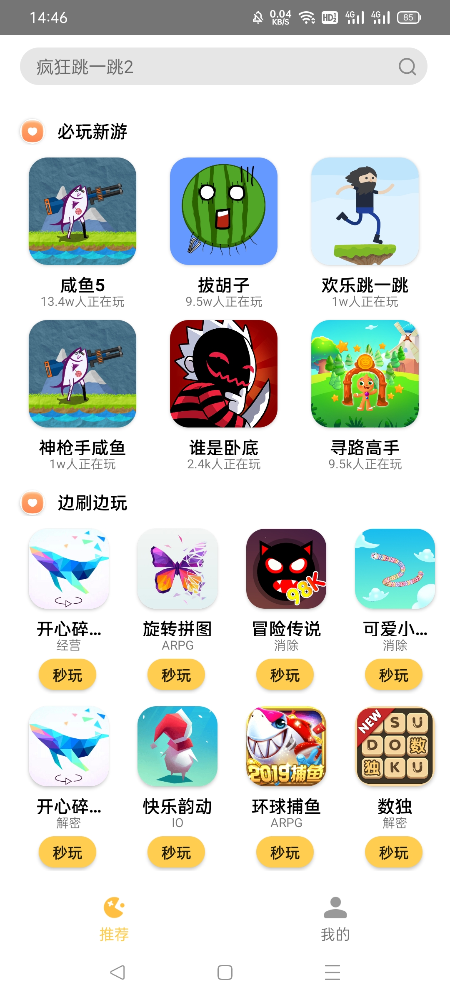

# Simple Game Store App by Android

## 1. Introduction

This is a simple game store App developed in 2024 Xiaomi Employment Practice Training Camp.

## 2. Dependencies
```
app/build.gradle
```

## 3. Http Server Interface
```
figure/server-network-interface
```

## 4. 3rd framework
[1. Glide](https://github.com/bumptech/glide) for showing img

[2. Okhttp](https://github.com/square/okhttp) for http request

[3. Gson](https://github.com/google/gson) for parsing the json data

[4. BaseRecyclerViewAdapterHelper](https://github.com/CymChad/BaseRecyclerViewAdapterHelper) for showing data in RecyclerView

[5. CardView](https://github.com/chiemy/CardView) for showing rounded corner images

[6. SmartRefreshLayout](https://github.com/scwang90/SmartRefreshLayout) for pulling down to refresh and pulling up to load more data

[7. MMKV](https://github.com/Tencent/MMKV) for the cache data storage

[8. FlowLayout](https://github.com/nex3z/FlowLayout) for showing the search history in a tag cloud view

## 5. Tips:
```
1. BaseRecyclerViewAdapterHelper 's version must be 2.9.50

2. change gradle source -> In ${project}/gradle/wrapper/gradle-wrapper.properties

       distributionUrl=https\://mirrors.cloud.tencent.com/gradle/gradle-7.2-bin.zip

3. Add jitpack Maven repositories -> In ${project}/settings.gradle

       dependencyResolutionManagement {
            repositoriesMode.set(RepositoriesMode.FAIL_ON_PROJECT_REPOS)
            repositories {
            google()
            mavenCentral()
            maven { url 'https://jitpack.io' }
            }
        }
        
4. Ubuntu Avd -> Open Terminal to run "sudo chown your-system-username -R /dev/kvm" first.
```

## 6. Attention
```
Don't provide the Xiaomi server base url due to the privacy. 
But you can refer to the figure/server-network-interface to create service using in this repo.
```

## 7. Repo Structure

### 1 > Privacy Activity


### 2 > Main Activity

<div style="display: flex; align-items: center;">
    
    <div style="width: 10%;"></div> 
    
</div>

### 3 > Detail Activity


### 4 > Pull down to refresh and Pull up to load more data

<div style="display: flex; align-items: center;">
    
    <div style="width: 10%;"></div> 
    
</div>

### 5 > Search game and Save search history

<div style="display: flex; align-items: center;">
    
    <div style="width: 10%;"></div> 
    
</div>

### 6 > Log in and Log out

<div style="text-align: center;">

<div style="display: flex; align-items: center;">
    
    <div style="width: 10%;"></div> 
    
    <div style="width: 10%;"></div> 
    
</div>

<div style="height: 20px;"></div>

<div style="display: flex; align-items: center;">
    
    <div style="width: 10%;"></div> 
    
</div>

</div>

## Acknowledgements
```
* 小米集团

* 小米华东软件中心

* 小米人力资源部
```

## Contact
```
ligaoqi02@gmail.com
```
